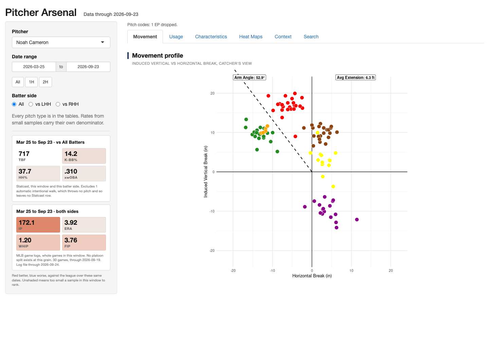

```{=html}
<div class="doc-actions">
  <a class="btn btn-outline-primary btn-sm" href="https://jonathanmerlin.shinyapps.io/pitcher-arsenal/" target="_blank" rel="noopener">Open the app in a new tab</a>
</div>

<div class="app-frame" id="app-frame">
  
  <div class="launch">
    <button class="btn btn-primary" id="launch-app" type="button">Launch the live app</button>
    <small>The app sleeps when idle and can take up to a minute to wake up.</small>
  </div>
  <div class="waking" aria-live="polite">
    <div class="spinner-border text-primary" role="status"></div>
    <p>Waking up the app. This can take up to a minute on the first visit of the day.</p>
  </div>
</div>

<script>
  // The app loads only on click, so readers who just skim this page
  // do not spend the shinyapps.io free tier's monthly active hours.
  document.getElementById("launch-app").addEventListener("click", function () {
    var frame = document.getElementById("app-frame");
    var iframe = document.createElement("iframe");
    iframe.src = "https://jonathanmerlin.shinyapps.io/pitcher-arsenal/";
    iframe.title = "Pitcher Arsenal (live)";
    frame.appendChild(iframe);
    frame.classList.add("loaded");
  });
</script>
```

## What it does

The app pulls MLB pitch data from Baseball Savant to chart any pitcher's usage, movement, location and other key characteristics, filtered by date range or batter handedness. Its search feature finds pitchers by specific criteria, such as fastballs above 90 mph.
