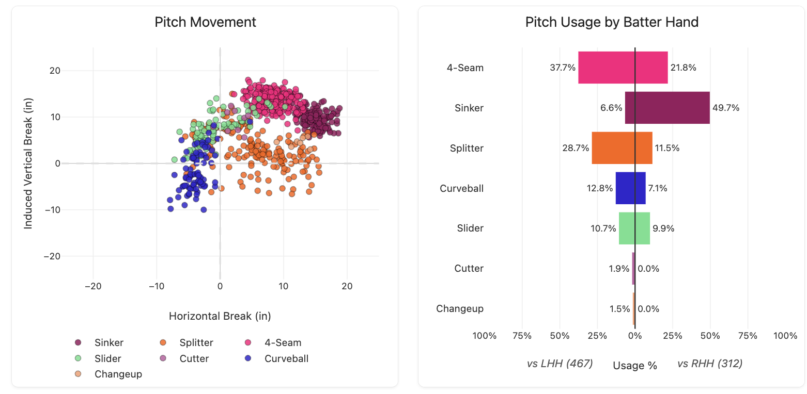
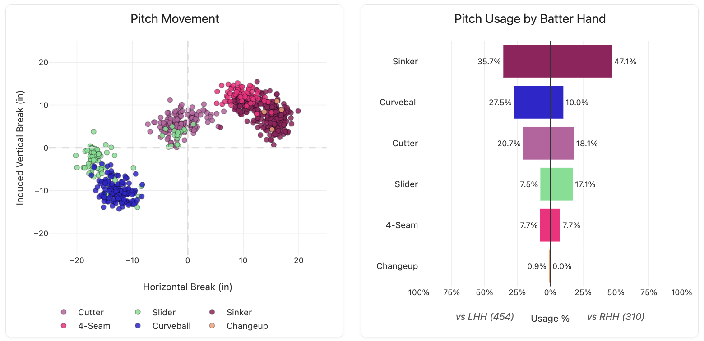

::: {.doc-actions}
[Download the PDF](4-Standout-Braves-MiLB-Pitchers.pdf){.btn .btn-outline-primary .btn-sm}
:::

As the 2026 MiLB season wraps up, I want to recap four standout seasons in the Braves' minor league system. Throughout 2026, we've seen Didier Fuentes thrive as a key part of the Braves bullpen; JR Ritchie has started 8 games for the Braves, posting a 4.50 ERA; and Owen Murphy has also contributed at the big-league level in a minimal sample. Ritchie and Murphy will look to add value down the stretch and make their case for a postseason roster spot.

In 2026, the highlights from the Braves farm have come from the offensive development of players like Eric Hartman, Tate Southisene, Alex Lodise, and Connor Essenburg, who have rightly earned national attention. Hartman's meteoric rise from a 20th-round pick in 2025 to the Braves' top prospect has been led by his uptick in power, contributing to a 25/50 season. He's struggled a bit since being promoted to AA (.182 AVG and 66 wRC+), but he proved early in the summer that he was too good for A+. He'll start next season in AA again, where he'll look to cut down on his K%, which crept over 30% after his promotion. Before getting hit on the wrist in his AA debut, Southisene enjoyed a successful summer, pumping 12 HRs, 18 2Bs, and 5 3Bs across Low-A and High-A. He had just 3 2Bs and 1 3B in his brief 2025 debut, so the power uptick was welcome. Lodise started slow in Low-A, hitting .250 with a 99 wRC+ while striking out 28%. Since then, he's turned it around, hitting .286 with a 136 wRC+ and cutting his K% down to 20%. Essenburg has posted a ridiculous 145 wRC+ across two lower levels of the minors while actually decreasing his K% once he reached A+ at the beginning of August.

With the big three pitchers finding their footing in the big leagues and losing their prospect eligibility, and the four position players making up the crème de la crème of the Braves farm system (Cam Caminiti deserves a shoutout here as well), I wanted to highlight four other arms that might not be household names yet. With their impressive seasons in 2026, they are certainly on my radar heading into 2027.

## 1. Ethan Bagwell, RHP (191st overall, 2024)

Ethan Bagwell is a big 6-foot-4, 230-pound righty who signed with the Braves for slot value in the 6th round of the 2024 draft out of Collinsville High School, just east of St. Louis. Bagwell threw well to start 2025 in Low-A, posting 14.1 IP with a 1.88 ERA before an undisclosed injury sidelined him for three months. While the sample was small (only 10 GS and 50 IP at Low-A in 2025), Bagwell's 2.88 ERA was encouraging as he entered 2026.

Bagwell didn't start 2026 strong, allowing 10 runs over his first 4 starts in his second stint in Low-A. However, once the calendar flipped to May, Bagwell turned a corner, going the entire month without allowing a run and striking out 26 over his 5 starts. He also walked only 6 hitters, down from 8 in his 4 starts before May. After two rough starts to begin June, Bagwell concluded the month with a 6 IP performance, allowing just 1 run against a strong Charleston RiverDogs (TBR) team. This earned him a promotion to A+ to begin July, ending his Low-A tenure with 68 IP and a 2.78 ERA. Potentially more exciting, Bagwell upped his strikeout rate from 15.5% in 2025 to 25.5% in 2026 while keeping his walks the same at ~8%. Bagwell has now thrown 8 A+ starts, 5 of which have been good (<2 ER), while the other three have been the opposite (4 or 5 ER). He finished A+ with 40 IP, bringing his season total north of 100, maintaining an ERA under 4 and a strikeout rate north of 20%.

Diving deeper into the profile, Bagwell is certainly a pitcher looking to keep the ball on the ground. He's done so at about a 50% clip, which sits above MLB average. One question entering 2026 was whether he could miss bats. He has answered well, increasing his strikeout rate as noted above and generating MLB-average chase rates, swinging strike rates, and in-zone contact metrics. It remains to be seen whether he can hold these numbers against upper-level hitters, but if he maintains average swing-and-miss ability, along with his ability to keep the ball on the ground and limit hard contact (.293 wOBA), he can certainly become a serviceable back-end rotation arm for the Braves.

One area for improvement for Bagwell will come against left-handed hitters. Through both levels this season, Bagwell's K-BB% against righties sits at 27% compared to just 9% against lefties. This is driven by a 10% increase in strikeouts and a near-doubling of his walk rate to 9%. Additionally, all 6 HRs Bagwell has allowed this season have come against lefties. Some more traditional stats also show a stark difference:

| | OPS | wOBA |
|:--|--:|--:|
| vs. lefties | .769 | .330 |
| vs. righties | .409 | .193 |

Furthermore, Bagwell is a big dude with decent extension down the mound from a low ¾ arm angle, creating a release height that is below average for a pitcher his size. Bagwell features a mid-90s fastball which, given his release, comes in with a flat approach angle, helping it play up in the zone. He'll also have a sinker in the low-mid 90s, which will help his ground ball rate. He rounds out a three-fastball approach with a low-90s cutter, which I think could be his ticket to suppressing lefty barrels. His go-to secondary offering is his sweeper around 80 MPH, which explains his swing-and-miss success against righties. He has a changeup, which he doesn't use much but could be another ticket to success vs. lefties.

## 2. Garrett Baumann, RHP (126th overall, 2023)

Garrett Baumann is even bigger than Bagwell, at 6-foot-8 and 240 pounds, and was an overslot 4th-round signee in the 2023 class out of Hagerty HS just outside Orlando. He started with a promising 2024, tossing 92 innings at a 3.42 ERA in Low-A before finishing with 1 start in A+, where he struck out 5 and pitched 7 scoreless innings. This gave the Braves enough confidence to assign him to A+ to begin 2025, where he would spend the entire season racking up 113.2 IP at a 3.40 ERA. His ERA predictors (FIP and xFIP) also aligned with his ERA. While his strikeout rates were about average at the lower levels (21-22%), his walk rates sat below MLB average at around 6%, making Baumann's command enticing for a player his size and profile.

The Braves followed a consistent developmental path with Baumann, assigning him to AA to begin 2026, where, at 21, he was one of the youngest pitchers at the level. While his ERA regressed slightly to the low 4s, Baumann threw 76 IP and raised his strikeout rate to 25%, though at the cost of some control, with his BB% ballooning to 10%. However, his 4.26 ERA might not reflect his true talent because it's inflated by 3 bad starts with 5, 6, and 7 ER, two coming against the Montgomery Biscuits (TBR) and the Biloxi Shuckers (MIL), two of the stronger AA teams. As you'd expect, these games saw higher walk rates, north of 10%. Regardless, after an electric 7.2 IP scoreless outing, with 7 Ks and only 1 BB, Baumann proved he was ready for AAA. After his promotion, Baumann became one of the top-5 youngest pitchers in AAA. In 10 starts since his promotion, Baumann's results have regressed to a mid-7s ERA, and his strikeout rate dropped to 17%. However, he flashed his upside in early August over a 3-start stretch, throwing 21 innings and allowing only 3 runs with a 24/5 K/BB ratio. After a rough start, he finished the AAA season strong in his last 7 starts, posting a 2.92 ERA, aided by improved control and a 6% BB%.

Using the available AAA data, Baumann has a 5-pitch arsenal with two fastballs in the mid-90s, though he has flirted with triple digits. His four-seam is ordinary by shape, with only ~14" of iVB and 8" of HB, so on one public Stuff+ model it grades as well below average. On the same model, his sinker grades out better (about league average), supporting its increased usage vs. righties (~50%). I'm assuming Baumann's four-seam shape regressed with the MLB ball in AAA, and his rough early starts with Gwinnett resulted from that regression. He then recognized he needed to throw his sinker more to righties, which caused his turnaround post-August. His increased sinker reliance helps Baumann keep the ball on the ground above 50% of the time, and this offering only has a 6% hard-hit rate and has yet to allow a barrel.

Baumann's best offering is his mid-80s splitter, which he uses to keep lefties at bay. This splitter is why he doesn't face the same platoon issues Bagwell does. Baumann features a "curveball," but its averages of -2" iVB and -4" HB suggest it is more of a bullet slider, though some pitches have reached near -10" iVB. He's used this pitch more vs. lefties (13% vs. 7% to RHH), which makes me think he wants more of the downer shape to get under the barrels of lefties. He'll need to refine the shape of this offering and look to make it more consistent in the offseason. The most fascinating pitch to me is his "slider," but it is definitely behaving more like a cutter, cementing Baumann as a three-fastball pitcher. This pitch is only ~88 MPH with 7.2" of iVB and -0.7" HB, and Baumann has good feel for the offering with a 68% strike rate. This makes it a viable pitch for him to go to when he's behind in counts and needs to steal strikes. I wonder if he thinks it's a slider or a cutter. If it's the former, there may be an opportunity to add velocity, which could improve its effectiveness.

While Baumann doesn't have a major platoon disadvantage vs. lefties thanks to his splitter, his fastball has not missed lefty bats. Its 11% barrel rate is 5x that vs. righties, and his hard-hit rate jumps from 19% to 44% vs. lefties. The fastball generates a <15% whiff rate vs. left-handed hitters, which sits below average.

All in all, 2026 was successful for Baumann, who proved his durability yet again and his ability to continue to get higher-level hitters out by staying off the barrel and keeping the ball on the ground. He'll look to continue improving his control and refining his lefty approach. Key areas for me include adding more depth to his curveball (or fully leaning into a bullet shape) and refining his "slider" by adding more velocity and iVB to round out his three-pitch fastball approach. With a strong showing in spring training, Baumann could be knocking on Atlanta's door sometime in 2027.

{fig-alt="Garrett Baumann's pitch movement plot and usage split by batter hand"}

## 3. Davis Polo, RHP (INTL signing, 2022, Colombia)

Polo is the true breakout candidate from this group. A 2022 signee from Colombia, Polo's first ~100 IP in pro ball were largely uninspiring. Polo pitched across three levels (DSL, CPX, and A) in 2022-2024, where his ERA consistently sat between the mid-4s and low 5s. His walk rates stayed low, never reaching 8%, but he rarely missed bats, with a strikeout rate below 20% once he reached the States. For a contact/control profile, he also didn't keep the ball on the ground and would get burned by the long ball. He seemed due for positive regression because he faced unusually high BABIPs over those three seasons, which helped explain why FIP and xFIP were consistently lower than his ERA. However, Polo's 2024 season unfortunately ended in early August when he suffered a shoulder injury that also forced him to miss the entire 2025 season.

After all the missed time, the Braves assigned Polo back to Low-A to begin 2026, where he thrived, tossing nearly 100 innings at a 3.25 ERA and seeing his K% tick up to 26%. This came with a bit of a trade-off in his control, but his K-BB% still sat at 17%, the highest of his career in US ball and above MLB average. His .202 average against was also the lowest of his career, and he increased his GB% north of 50% for the first time in pro ball. All of this earned Polo a promotion to A+, but it didn't last long. In two starts for Rome, Polo threw 11 innings, allowing 4 runs (2 via the long ball on 9/2) while striking out 18 (12 in his second start) and walking only 4. He allowed just 6 hits across both outings.

With Rome's season ending on 9/6, the Braves wanted to see what Polo could do in AA, where he's turned in two more quality starts, highlighted by 6 shutout innings in his AA debut with 8 more strikeouts against a quality Montgomery Biscuits (TBR) lineup, where Polo notably held Rays top prospect Theo Gillen hitless in three PAs. Polo then faced the Biscuits again in Columbus for the season finale, battling through 6.1 innings, allowing 3 ER and 2 HRs, and walking 3 hitters for the first time since July. Overall, Polo has thrown 123 IP to a 3.15 ERA, with an 18.5% K-BB% and a rising GB% of 51%. His higher ground-ball rate has improved his efficiency and helped him throw 6+ innings in 8 of his last 9 starts, with only 1 outing under 90 pitches. Fresh off shoulder surgery, this was a great outcome for Polo and the Braves.

Diving into Polo's stuff, his sinker will sit 92-93, but he has been up to 95. Polo's best pitch is his changeup, with big arm-side movement and some flirting with 0" iVB. Polo's changeup will help him stay successful vs. lefties in the upper minors, as he's currently running a 33% K rate and 40% whiff rate vs. LHH. However, Polo will need to work on his breaking balls moving away from RHH if he is going to survive as a starter long term.

Polo has now been called up to AAA to finish the 2026 MiLB season, becoming the youngest player on the Stripers' roster at 21. Polo becomes eligible for the Rule 5 Draft in December 2026, meaning the Braves must decide whether he is worth protecting with a spot on the 40-man roster. His performance through the season has been encouraging and, hopefully, with 1 more good start, he can claim a spot on the roster heading into the offseason. On the other hand, with the lockout pending, the Braves would not be able to contact any players on their 40-man roster, so if they feel they need to contact Polo this offseason to continue his development, they could risk not protecting him, leaving him susceptible to being selected by a different team. Given his lack of track record in the upper minors and his injury history, this could be a viable strategy.

In conclusion, after missing all of 2025, throwing 100+ innings across what will be 4 levels is undoubtedly a success for Polo. What was probably an easy decision about his Rule 5 candidacy at the beginning of 2026 has become a conversation about whether the Braves need to protect him. If protected, he could return to AAA and potentially be called upon to make spot starts to eat some innings for the big league club in 2027.

## 4. Cedric De Grandpre, RHP (395th overall, 2022)

Cedric De Grandpre is a Braves scouting masterclass. A 13th-round pick out of Chipola JC in 2022, De Grandpre pitched briefly across two levels after being drafted. After a strong start to 2023 in Low-A, where he ran a K-BB% of 26.4%, De Grandpre got the bump to A+, where his strikeout rate nearly halved and his ERA jumped by over 4 points to 5.13. He would undergo Tommy John surgery in September of 2023, causing him to miss all of the 2024 season. After returning to A+ in 2025, De Grandpre pitched 53 innings, regaining his high strikeout rate (28%) but seeing his control regress significantly, with a BB% north of 17%. He ran a BB% of just 6% in 2023 pre-injury. All of this contributed to De Grandpre going unprotected entering the 2025 Rule 5 Draft, but he went unselected and stayed in the Braves org for 2026.

Diving into his stuff, De Grandpre came back from injury throwing harder than before. His fastball is up to 95, up from the low-90s pre-injury. He doesn't really throw his four-seam much, though, given its stock movement profile, instead opting for his sinker that gets ~16" HB. It is a smart choice to rely on the sinker over the four-seam because it is roughly the same velocity with a better movement profile, which likely means a stuff model would favor the sinker. He'll throw two different breaking balls: a curveball around 85 MPH with -11" iVB and -13" HB, and a sweeper with -4" iVB and -16" HB that's a few ticks slower. De Grandpre's usage of these two breaking balls makes sense, with him favoring the downer curveball to lefties and the sweeper vs. righties. He throws a cutter to bridge them, with 6" iVB and -1" HB at 88 MPH, making it relatively soft and without premium shape. It makes sense that this pitch yields a 66% hard-hit rate to righties, though De Grandpre still throws it 18% of the time. By decreasing his cutter usage to righties, especially in two-strike counts (13%), he could minimize hard contact, especially in favorable counts. De Grandpre's breaking balls are certainly his best pitches, so leaning into those more, especially vs. righties (27% combined usage), will help him get more whiffs, increase his ground ball rate again, and suppress hard contact.

One year further removed from surgery, De Grandpre started 2026 back in A+, where his K-BB% improved to 23%. His ERA remained in the low 4s, but his FIP and xFIP would suggest some unluckiness tied to HRs allowed. Nearly 23% of fly balls De Grandpre allowed resulted in HRs. A lot has been said about how the minor league ball changed to allow more HRs, and De Grandpre seems to have been a victim. Regardless, at 24 years old, his 33% strikeout rate in 55 IP was enough for the Braves to bump him up to AA. In 6 AA starts, De Grandpre kept his strikeout rate north of 30%, showed positive regression in the HR/FB category (6%), and raised his ground ball rate to over 50% for the first time since 2023. AA didn't pose much more of a challenge for De Grandpre, who posted a .182 AVG against and a 1.03 WHIP.

Given his lost time and maintained Rule 5 eligibility for 2026, the Braves aggressively promoted De Grandpre up to AAA. In his 43.2 IP for Gwinnett, De Grandpre hasn't been as successful, with his walk rate climbing back above 12% and his ERA jumping back into the mid-4s. We have xERA at the AAA level, and De Grandpre's rises even further to 6.21 when you account for expected results. De Grandpre's barrel% sits at nearly 10%, which is well above MLB average, though his hard-hit rate is below average at 34.5%. While it's not a foregone conclusion, De Grandpre has pitched his way back into relevance within the Braves system and should require a real conversation ahead of the November 17th protection deadline.

{fig-alt="Cedric De Grandpre's pitch movement plot and usage split by batter hand"}
