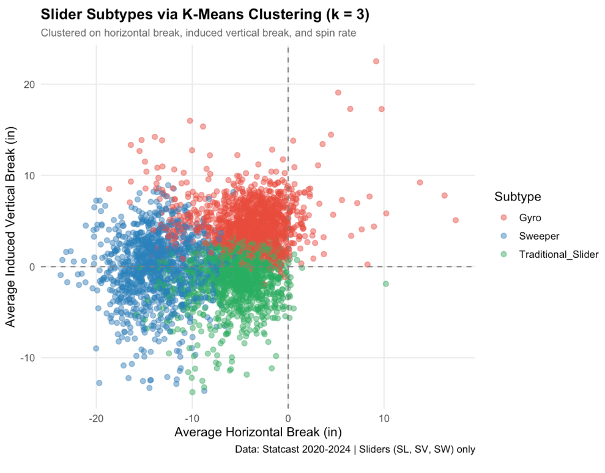
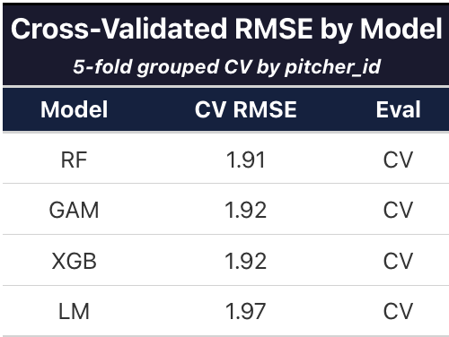
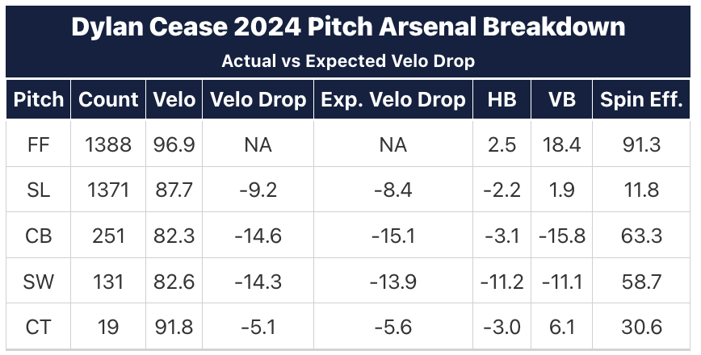
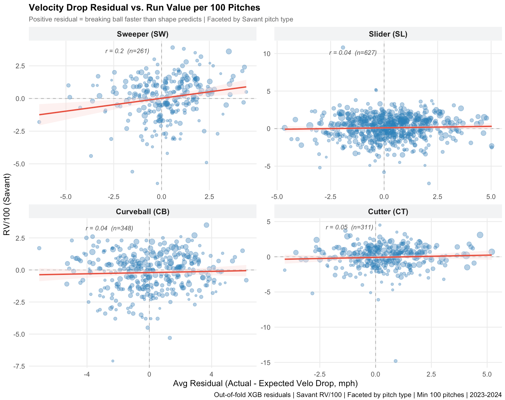
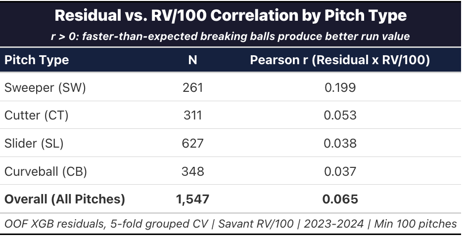
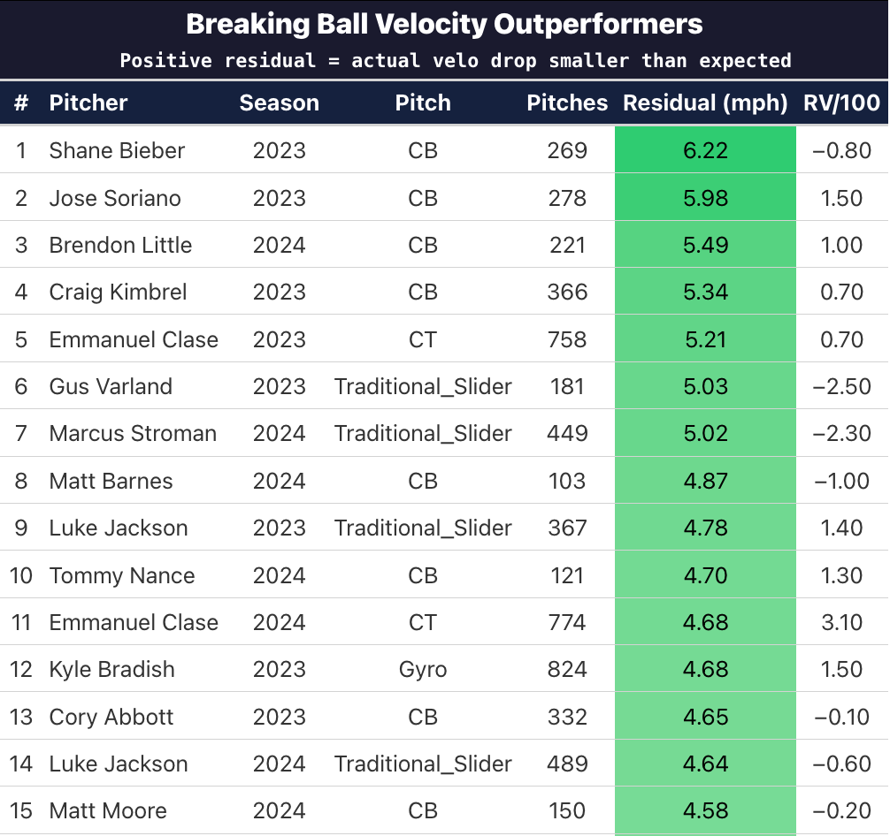
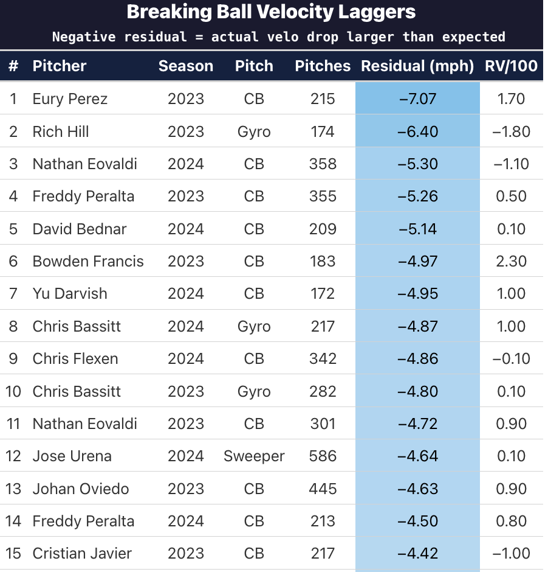

::: {.doc-actions}
[Download the PDF](Sweep-Velocity-Tradeoff.pdf){.btn .btn-outline-primary .btn-sm}
Statcast 2020 to 2024, about 3.1 million pitches
:::

::: {.verdict}
**Result: a weak signal that appears only above a 100-pitch minimum, strongest in sweepers.** At that threshold, the velocity residual correlates with RV/100 at r = 0.065 (p = 0.01) across 1,547 pitcher-pitch-seasons. Sweepers carry the strongest signal (r = 0.199). The residual is more useful for finding individual pitchers who may have velocity available than as a league-wide predictor.
:::

## Introduction

Every pitcher throws a breaking ball that is slower than his fastball. That's by design. But the size of that velocity gap varies enormously across pitchers and pitch types, and not all of that variation is explained by the physical characteristics of the pitch. Some pitchers throw breaking balls that are faster than their shape would predict, while others leave velocity on the table relative to their movement profile. The question I explore here is whether this velocity gap, "delta," matters for in-game pitch effectiveness.

To answer it, I built a model in R that predicts the expected velocity drop between a pitcher's fastball and each of his breaking balls from movement profile, spin characteristics and release data. The residual, the part of the velocity gap that shape cannot explain, is then tested against run value per 100 pitches (RV/100) from Baseball Savant. My hypothesis was that pitchers whose breaking balls are faster than their shape predicts would get better outcomes on those pitches, which would show up as a higher RV/100.

## Data

The model uses pitch-level Statcast data from 2020 through 2024, roughly 3.1 million pitches, aggregated to one row per pitcher, per pitch type, per season. Changeups, screwballs, knuckleballs, eephus pitches and unknown pitch types are excluded because they are not breaking balls.

The target variable is **delta**: the velocity difference between a pitcher's breaking ball and his weighted average fastball velocity (four-seamers and sinkers combined, weighted by pitch count). A less negative delta means the breaking ball is faster relative to the fastball.

For the in-game comparison, I sourced RV/100 by pitcher and pitch type for 2023 and 2024. Validation is restricted to those seasons because the sweeper (SW) became a distinct pitch classification in 2023. Before that, sweepers were coded as sliders, which would contaminate the pitch-level join for every slider subtype. The model itself still trains on the full 2020 to 2024 window.

## Feature engineering

One important design choice involved spin efficiency. I initially derived a velocity-based spin efficiency measure, `(active_spin / raw_spin) * 100`, where active spin itself depends on pitch velocity. That created leakage: delta, the target, is a function of velocity, so the feature handed every model a shortcut. I caught it in diagnostics when the model performed suspiciously well. The fix was a trigonometric proxy derived from spin direction, which keeps the information about how efficiently the ball spins without leaking velocity into the feature set.

### Slider clustering

Sliders are not one homogeneous category. A sweeper with 17 inches of horizontal break behaves very differently from a tight gyro slider. Rather than treat all sliders as one group, I used k-means clustering (k = 3) on horizontal break, IVB and spin rate to split sliders into three movement-based subtypes: sweeper, gyro and traditional slider.

The cluster label lives in its own column (`pitch_subtype`) and never overwrites the original Statcast `pitch_type`, which preserves the join key for the external validation data. Overwriting `pitch_type` would have broken the validation pipeline, since there would be no clean key to match against the Savant arsenal files.

{#fig-1 fig-alt="Scatter of slider movement colored by k-means subtype"}

## Model structure

Four models of increasing flexibility were trained and compared on the same cross-validation splits: linear regression (LM), a generalized additive model (GAM), random forest (RF) and XGBoost. All four used the same eight predictors:

- Average spin (rpm)
- Induced vertical break
- Horizontal break
- Release extension
- Release height
- Average fastball velocity (mph)
- Spin direction (radians)
- Spin efficiency (radians)

These features describe the shape of each pitch without disclosing its velocity. Each model learns what velocity gap each shape profile should produce, so the residual captures whatever the shape cannot explain.

{#fig-2 fig-alt="Table of 5-fold grouped CV RMSE: RF 1.91, GAM 1.92, XGB 1.92, LM 1.97"}

### Cross-validation design

Cross-validation uses 5-fold splits grouped by `pitcher_id`, so no pitcher appears in both the training and test set within a fold. Without grouping, a model could memorize pitcher-specific patterns and artificially deflate CV error by predicting on pitchers it has already seen. Grouping forces the model to generalize to entirely unseen pitchers.

### Out-of-fold predictions

A single train/test split would produce residuals for only about 10% of pitchers. Instead, the loop saves held-out predictions across all five folds, so every pitcher is held out exactly once and has a predicted delta.

**Residual = actual delta − expected delta.** A positive residual means the breaking ball is faster than its shape predicts; a negative residual means it is slower.

## Arsenal example

To make the model tangible, the table below shows Dylan Cease's 2024 arsenal with actual and expected velocity drop. Cease is a useful example because his breaking balls all land within about 1 mph of expectation, meaning his velocity gaps are well explained by pitch shape.

{#fig-3 fig-alt="Table of Dylan Cease's 2024 breaking balls with actual and expected delta"}

## Validation against RV/100

To matter for decisions, the residual has to relate to in-game results. I joined the out-of-fold residuals to Baseball Savant's RV/100 on pitcher, season and pitch type, so each row is one pitcher's pitch type in one season. I computed Pearson r between residual and RV/100 within each pitch type and across the full dataset. The scatter plots are faceted by Savant pitch type (sweeper, slider, curveball, cutter), so every dot in a panel joins to the same external data.

{#fig-4 fig-alt="Faceted scatter plots of residual against RV/100 for sweepers, sliders, curveballs and cutters"}

I started with a 30-pitch minimum. At that threshold the overall correlation was r = 0.014 (p = 0.50), which I first read as a null result. Raising the threshold to 100 pitches removed noisy small-sample rows and revealed a weak but statistically significant correlation of r = 0.065 (p = 0.01) across 1,547 pitcher-pitch-season observations. Sweepers showed the strongest signal at r = 0.199, while cutters, sliders and curveballs ranged from 0.037 to 0.053. The relationship is weak and appears only once small samples are filtered out.

{#fig-5 fig-alt="Table of Pearson correlations by pitch type"}

## Interpreting the results

There are a few possible reasons the residual carries so little signal:

1. The framing assumes a positive residual should help through deception and stuff. There is a credible argument in the opposite direction: a larger gap between fastball and breaking ball disrupts timing, so a slower-than-expected breaking ball could be more effective. If both effects exist and partially cancel, the net correlation would be small, which is what the data shows.
2. RV/100 is an aggregate outcome that includes contact quality, sequencing, count leverage and batter quality. If the residual captures something real about deception, it may show up in more direct swing-decision metrics (chase rate, whiff rate) without surfacing in total run value.

## Leaderboards

Outperformers are pitchers whose breaking balls are consistently faster than expected. Laggers are pitchers whose breaking balls are consistently slower. The laggers are the more interesting group for player development, because the gap may represent velocity that is available. Even without a league-wide correlation, a front office could look pitcher by pitcher: a lagger with a poor RV/100 on a specific pitch is a candidate to explore whether more velocity is physically available.

{#fig-6 fig-alt="Leaderboard of pitchers whose breaking balls are faster than expected"}

{#fig-7 fig-alt="Leaderboard of pitchers whose breaking balls are slower than expected"}

Curveballs dominate both leaderboards because they have the largest velocity gap from the fastball, which leaves the most room for actual delta to deviate from expectation in either direction. A pitcher on the laggers table is not necessarily underperforming: his breaking ball is slower than its shape predicts, which could be an intentional pitch design choice.

## Limitations and next steps

This was my first baseball research project, and there are limitations I would address next:

1. Automated feature selection, such as Boruta, would give a rigorous justification for variable inclusion and could reveal interactions that manual testing missed.
2. XGBoost hyperparameters were tuned by iterative testing rather than a grid search. Systematic tuning could improve accuracy at the margins.

The next step is validating the residual against swing-decision metrics such as chase and whiff rates rather than run value.
