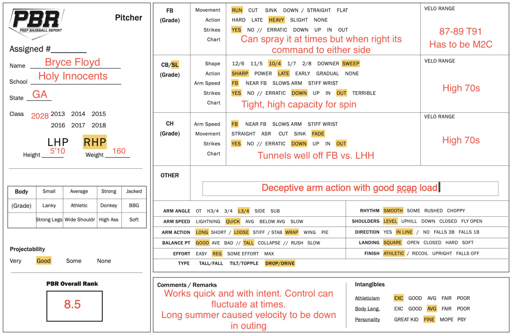

::: {.doc-actions}
[Download the PDF](Bryce-Floyd-Report.pdf){.btn .btn-outline-primary .btn-sm}
:::

**Summary.** Works quickly and with intent, from a deceptive, low three-quarter arm action. Shows flashes of command. Athletic mover on the mound.

| Pitch | Velo | Notes |
|:-------|:-------|:------------------------------------------------|
| Fastball | 87-89, T91 | Heavy arm-side run. Flashed command to either side. |
| Slider | High 70s | 10-to-4 sweep, sharp and late, thrown with fastball arm speed. |
| Changeup | High 70s | Maintains arm speed. Tunnels well off the fastball against LHH. |

[{.report-image fig-alt="Prep Baseball Report pitcher evaluation form for Bryce Floyd"}](Bryce-Floyd-Report.pdf)
