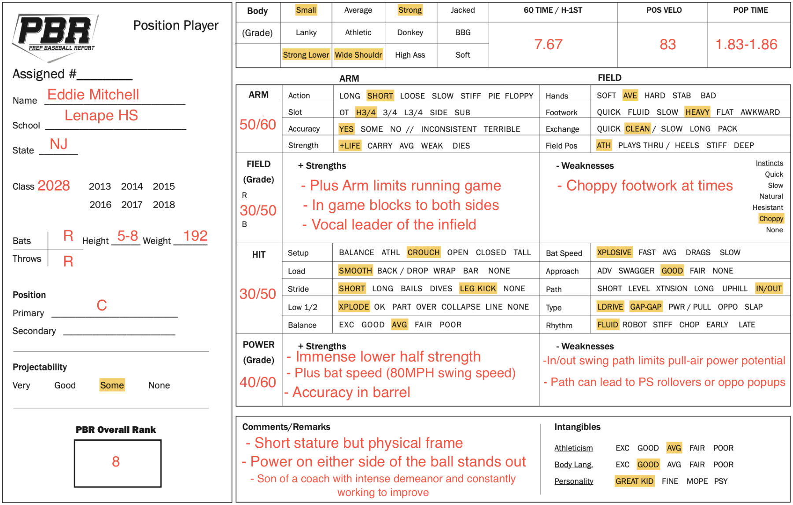

::: {.doc-actions}
[Download the PDF](Eddie-Mitchell-Report.pdf){.btn .btn-outline-primary .btn-sm}
:::

**Summary.** A short-statured catcher with a physical frame showing gap-to-gap power. Pop times of 1.83 to 1.86 with an arm to control the running game.

| Tool | Grade | Notes |
|:-------|:-------|:------------------------------------------------|
| Hit | 30/50 | Smooth load, line-drive and gap-to-gap approach. Bat-to-ball skill projects to be able to handle upper-level velocity. |
| Power | 40/60 | Plus bat speed and immense lower-half strength. Drives the ball with authority to all fields. |
| Arm | 50/60 | Short, accurate arm action with carry. Plus arm limits the running game. |
| Field | 30/50 | Blocks to both sides in game and is a vocal leader of the infield. Footwork is choppy at times. |

[{.report-image fig-alt="Prep Baseball Report position player evaluation form for Eddie Mitchell"}](Eddie-Mitchell-Report.pdf)
