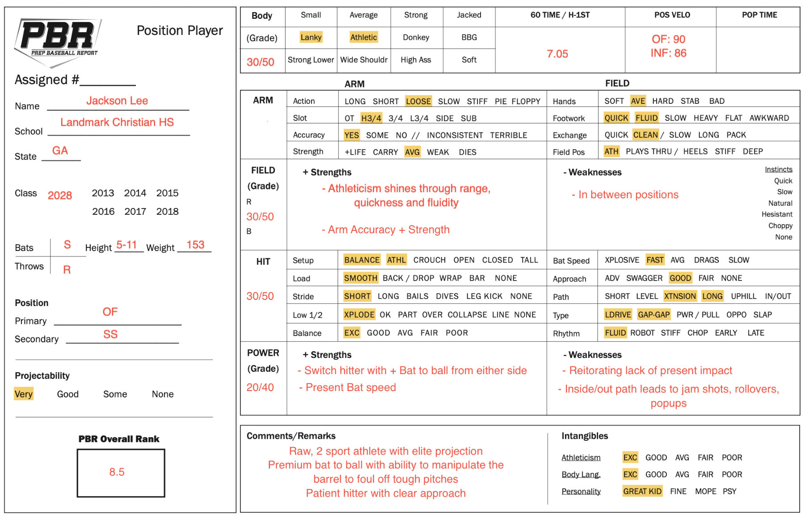

::: {.doc-actions}
[Download the PDF](Jackson-Lee-Report.pdf){.btn .btn-outline-primary .btn-sm}
:::

**Summary.** A raw two-sport athlete with elite projection. Premium bat-to-ball skill, with the ability to manipulate the barrel to foul off tough pitches, and a patient hitter with a clear approach.

| Tool | Grade | Notes |
|:-------|:-------|:------------------------------------------------|
| Hit | 30/50 | Balanced, athletic setup. Line-drive, gap-to-gap approach. Plus bat-to-ball from either side of the plate. |
| Power | 20/40 | Present bat speed, but little present impact. |
| Field | 30/50 | Athleticism shows through range, quickness and fluidity. Arm accuracy and strength. Currently in between positions. |

[{.report-image fig-alt="Prep Baseball Report position player evaluation form for Jackson Lee"}](Jackson-Lee-Report.pdf)
