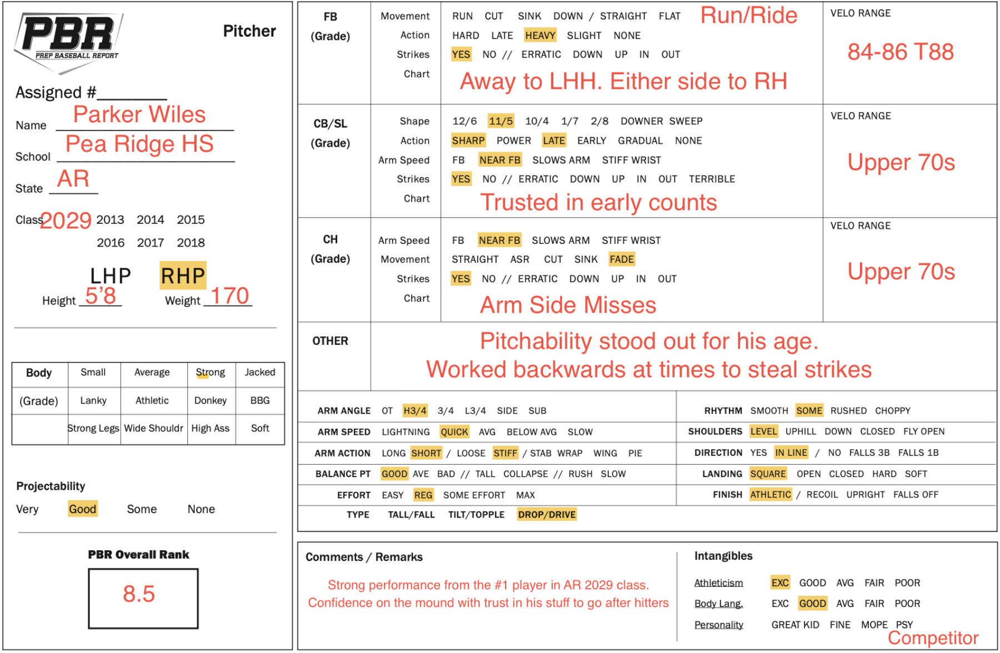

::: {.doc-actions}
[Download the PDF](Parker-Wiles-Report.pdf){.btn .btn-outline-primary .btn-sm}
:::

**Summary.** The #1 player in Arkansas's 2029 class. His pitchability and confidence stood out for his age.

| Pitch | Velo | Notes |
|:-------|:-------|:------------------------------------------------|
| Fastball | 84-86, T88 | Run and ride, heavy sinkers at times. |
| Curveball / slider | Upper 70s | Sharp 11-to-5 shape, maintains arm speed. Trusted in early counts to premium hitters. |
| Changeup | Upper 70s | Scattered command at times, but flashed plus fade away from lefties. |

[{.report-image fig-alt="Prep Baseball Report pitcher evaluation form for Parker Wiles"}](Parker-Wiles-Report.pdf)
